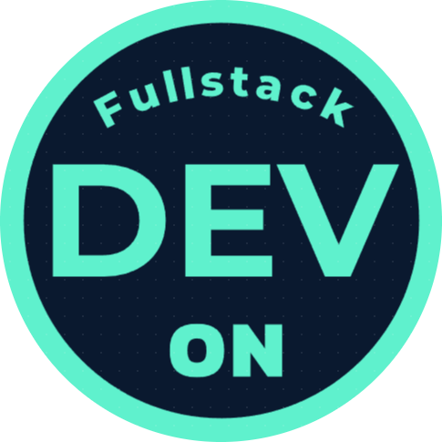

<!-- Logo -->

    

<!-- Introduction Text -->

    <h3>
        
            My Portfolio Website 
        
          
        <a href="https://devongifford.vercel.app/">
            
                https://devongifford.vercel.app/
            
        </a>
    </h3>

<!-- Tech Used in this Project -->

    

 
 

### 🚀 About This Project

---

This portfolio was inspired by the [v4 version of Brittany Chiang’s site](https://v4.brittanychiang.com/), which remains a standout in developer portfolio design. While her original was built with **Gatsby**, I approached the rebuild using a modern stack — **Next.js**, **TypeScript**, and **Tailwind CSS** — tailored to my own preferences.

Along the way, I introduced a number of refinements, both in implementation and user experience, while staying true to the spirit of the original design. The project has recently been upgraded to **Next.js 15** and **React 19**.

 

### 🙏 Acknowledgements

---

While I built this project from the ground up, it's important to credit [Brittany Chiang](https://brittanychiang.com) as the source of inspiration. All design credit for the original concept goes to her. You're welcome to fork or adapt this project — just please include proper attribution to Brittany.

> If you found this repo useful, a ⭐ is always appreciated!

 

### 📄 License

---

MIT License (Click to Expand)

 

Copyright 2025 - Devon Gifford

Permission is hereby granted, free of charge, to any person obtaining a copy of this software and associated documentation files (the “Software”), to deal in the Software without restriction, including without limitation the rights to use, copy, modify, merge, publish, distribute, sublicense, and/or sell copies of the Software, and to permit persons to whom the Software is furnished to do so, subject to the following conditions:
The above copyright notice and this permission notice shall be included in all copies or substantial portions of the Software.

THE SOFTWARE IS PROVIDED “AS IS”, WITHOUT WARRANTY OF ANY KIND, EXPRESS OR IMPLIED, INCLUDING BUT NOT LIMITED TO THE WARRANTIES OF MERCHANTABILITY, FITNESS FOR A PARTICULAR PURPOSE AND NONINFRINGEMENT. IN NO EVENT SHALL THE AUTHORS OR COPYRIGHT HOLDERS BE LIABLE FOR ANY CLAIM, DAMAGES OR OTHER LIABILITY, WHETHER IN AN ACTION OF CONTRACT, TORT OR OTHERWISE, ARISING FROM, OUT OF OR IN CONNECTION WITH THE SOFTWARE OR THE USE OR OTHER DEALINGS IN THE SOFTWARE.

