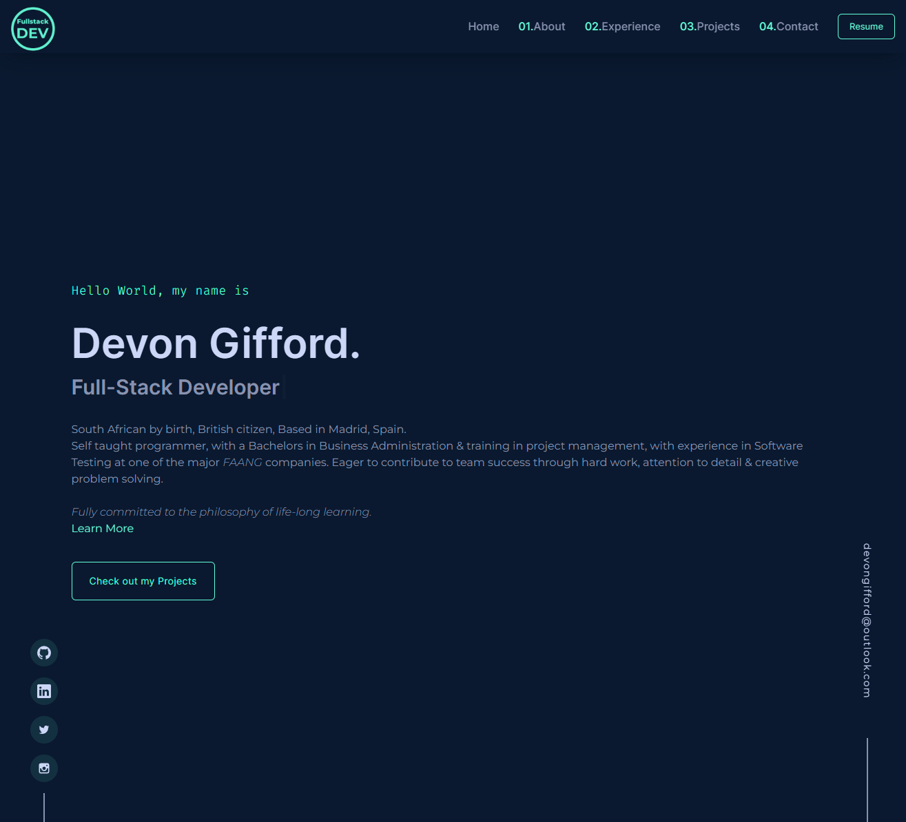

<!-- :ogo -->
<p align='center'>
    
</p>

<!-- Introduction Text -->
<div align="center">
    <h1>👋 Welcome to my Portfolio's GitHub Repo 👋 </h1>
    <h3> ❗🔗-www.devongifford.com - vesion 2.1 </h3>
    <h5>
        This is the second iteration of <a href="">devongifford.com🎯</a>
        <h6>
            built with <a href="https://nextjs.org">Next.js</a> &
            hosted by <a href="https://vercel.com/">Vercel</a> <br>
            other technologies used in this project include:
        </h6>
    </h5>
</div>

<!-- Tech Used in this Project -->
<p align='center'>
    <a href="https://skillicons.dev">
        
    </a>
</p>
<hr>

<!-- Demo Image -->
<p align='center'>
    
</p>


<h1 align='center'> Welcome & Introductory </h1>

### About & History of this project 🤓
---------------------------------------------------
Once upon a time, there was a dedicated individual who embarked on a journey into the world of web development. As they began their learning process, they discovered a vast ocean of inspirational portfolios that showcased the incredible possibilities of modern web design. Among these, they stumbled upon a portfolio website that captivated their attention with its sleek and contemporary aesthetics.
<br>
<br>
However, a wave of demoralization washed over them as they realized that this impressive project was constructed with technologies that seemed light years beyond their current skill set, such as; Framer-Motion-Animations, Gatsby.js, TypeScript and Tailwind CSS.
<br>
Undeterred by this initial setback, our aspiring developer made a pivotal decision: instead of succumbing to discouragement, they viewed this encounter as a catalyst for growth. With unwavering determination, they embarked on a journey of self-improvement. They devoted countless hours to study and practice, devouring every piece of knowledge they could find.
<br>
<br>
As time flowed onward, six months passed —a period of intense dedication and perseverance. Our aspiring developer emerged from this transformative experience with newfound confidence and proficiency. They had successfully acquired the skills necessary to build that once seemingly unattainable portfolio project from scratch. Not only that, but they also went above and beyond by incorporating their own innovative ideas and enhancements, elevating the project to new heights.
<br>
<br>
This individual's triumph was not merely measured by their ability to replicate the initial inspirational portfolio; it was a testament to their tenacity, adaptability, and unyielding passion for self-improvement. Their accomplishment exemplified the spirit of continuous learning and growth that is highly sought after in the world of web development.
<br>
When an employer encounters this inspiring story, they are met with an impressive narrative of an individual who faced a daunting challenge head-on, turned it into an opportunity for growth, and emerged victorious. This individual's journey showcases their ability to embrace complexity, overcome obstacles, and strive for excellence. 
<br>
Their story serves as a testament to their resilience, adaptability, and commitment to personal and professional development—a remarkable tale that speaks volumes about their potential as a valuable asset to any team or organization.
<br>

### Credit where credit is due: <em>Brittany Chiang</em> 🙏
---------------------------------------------------

As mentioned in the about section, while I built this website from scratch myself, I heavily used Brittany Chiang's website as inspiration and therefore all credit goes to her.

Website - https://brittanychiang.com/ <br>
GitHub - https://github.com/bchiang7/v4
<br><br>

<h1 align='center'>"To-Do-List" & "The-Done-List"</h1>

### Version 3.0 🌱
---------------------------------------------------

These are some of the things I would like to do with this project
<!-- VERSION 2.1 -->
<details>
<summary>
<h4> These are some of the things I would like to do with this project </h4>
</summary>
A list of all the issues I have fixed and features I have added.
<!-- UPDATE TEMPLATE -->
<details>
<summary><h6> ISSUE / UPGRADE </h6></summary>
<li> list of issues
<li> list of issues
<pre><code>
Solution🎯
</code></pre>
</details> 
<!-- CLOSING DIV -->
<details>


<br><br>

### Previouse Versions and Fixes 👴
---------------------------------------------------

<!-- VERSION 2.1 -->
<details>
<summary>
<h4> Version 2.1 </h4>
</summary>
A list of all the issues I have fixed and features I have added.
<!-- NAVBAR SECTION -->
<details>
<summary><h6> NavBar Section </h6></summary>
<li> Create interactive logo and fixing the broken link
<pre><code>
Solution🎯
</code></pre>
<li> Clean up the mobile version of the navbar - centering and styling
<pre><code>
Solution🎯
</code></pre>
</details> 
<!-- HOME/BANNER SECTION -->
<details>
<summary><h6> Banner Page section </h6></summary>
<li> Increase the size and responsivness of the heading text's 
<pre><code>
Solution🎯
</code></pre>
<li> Update button link & styling
<pre><code>
Solution🎯
</code></pre>
</details> 
<!-- ABOUT SECTION -->
<details>
<summary><h6> About Section </h6></summary>
<li> Complete overhaul of the layout of this section - ersponsivness issues
<pre><code>
Solution 🎯
</code></pre>
<li> Update the styling of favourite technologies heading
<pre><code>
Solution 🎯
</code></pre>
</details>
<!-- EXPERIENCES SECTION -->
<details>
<summary><h6> Experiences section </h6></summary>
<li> Creating a mobile view section section - with a hidden horizontal screen 
<pre><code>
Solution 🎯
</code></pre>
<li> Decrease the gap between 'About' & 'Experiences' section
<pre><code>
Solution 🎯
</code></pre>
</details>
<!-- PROJECTS SECTION -->
<details>
<summary><h6> Projects Section </h6></summary>
<li> Make titel fo projects clickable and with a hover effect. (mobile and desktop view)
<pre><code>
Solution 🎯
</code></pre>
<li> Fix responsivness of noteworthy projects forsmall mobile devices
<pre><code>
Solution 🎯
</code></pre>
<li> Fix animation loading bug 
<pre><code>
Solution 🎯
</code></pre>
<li> Import small photos for moile view
<pre><code>
Solution 🎯
</code></pre>
</details>
<!-- Contact & Footer Section -->
<details>
<summary><h6> Contact & Footer Section </h6></summary>
<li> Fix footer bug not showing up in medium screen sizes
<pre><code>
Solution 🎯
</code></pre>
<li> Adding credit to Brittany Chiangs website on all resolutions
<pre><code>
Solution 🎯
</code></pre>
<li> Increase size of headings and responsivness of text
<pre><code>
Solution 🎯
</code></pre>
</details>
</details> 
<!-- CLOSING -->


<!-- VERSION 2.0 -->
<details>
<summary>
<h4> Version 2.0 </h4>
</summary>
A list of all the issues I have fixed and features I have added.
<!-- TICKET TEMPLATE -->
<details>
<summary><h6> HEADING </h6></summary>
<li> issue
<pre><code>
Solution 🎯
</code></pre>
</details>
<!-- NAVBAR SECTION -->
<details>
<summary><h6> NavBar Section </h6></summary>
<li> Create a Logo for my portfolio and include it in the Navbar Section
<pre><code>
Solution🎯
</code></pre>
<li> Create a mobile view for the Navbar section with media queries 
<pre><code>
Solution🎯
</code></pre>
<li> Adding a button with a link to a pdf of my CV 
<pre><code>
Solution🎯
</code></pre>
</details> 
<!-- HOME/BANNER SECTION -->
<details>
<summary><h6> Banner Page section </h6></summary>
<li> Include a auto typing heading effect with job titles 
<pre><code>
Solution🎯
</code></pre>
<li> Include a delayed loading effect 
<pre><code>
Solution🎯
</code></pre>
<li> Update the links and sizing of the headings with media queries 
<pre><code>
Solution🎯
</code></pre>
</details> 
<!-- ABOUT SECTION -->
<details>
<summary><h6> About Section </h6></summary>
<li> Create Skills-Icons with some hover effects
<pre><code>
Solution 🎯
</code></pre>
<li> Update the profile image and try replicate the design and animations of Britanny Chiang
<pre><code>
Solution 🎯
</code></pre>
<li> Making the image dynamic 
<pre><code>
Solution 🎯
</code></pre>
</details>
<!-- EXPERIENCES SECTION -->
<details>
<summary><h6> Experiences section </h6></summary>
<li> Replicate the same style as Brittany Chang
<pre><code>
Solution 🎯
</code></pre>
<li> Trying to implement a way to keep this code dry and easier to update
<pre><code>
Solution 🎯
</code></pre>
</details>
<!-- PROJECTS SECTION -->
<details>
<summary><h6> Projects Section </h6></summary>
<li> Fixing a bug with medium screen sizes causing componenets to dissapear
<pre><code>
Solution 🎯
</code></pre>
<li> Create a special Mobile view for capston projects
<pre><code>
Solution 🎯
</code></pre>
<li> Fixing a bug for styling issues in the 'other noteworthy projects'
<pre><code>
Solution 🎯
</code></pre>
</details>
</details> 
<!-- CLOSING -->


<!-- VERSION 1.0  -->
<details>
<summary>
   <h4> Setting up the project - high level overview: </h4>
</summary>
A list of required componenets and thoughts behind creating and instantiating my portfolio 
<!-- TICKET 1 -->
<details>
<summary><h6> Setting up the environment </h6></summary>
<ul>
<li>Installing Node.js: Download and install Node.js from https://nodejs.org
<li>Create a new project directory: Open a terminal and navigate to the desired location for your project. Run the command <code>mkdir project-portfo </code> to create a new directory.
<li>Initializing a new Next.js project: Inside the project directory, run <code>npx create-next-app .</code>  to initialize a new Next.js project.
<li>Install Tailwind CSS: Run <code> npm install tailwindcss </code> to install Tailwind CSS as a project dependency.
</ul>
</details>
<!-- TICKET 2 -->
<details>
<summary>
<h6> Configuring Tailwind CSS: </h6>
</summary>
<ul>
<li>Generating a Tailwind CSS configuration file: <br>Run <code> npx tailwindcss init</code> to generate the tailwind.config.js file.
<li>Customize the configuration: Open tailwind.config.js and modify the default settings.
<li>Including Tailwind CSS in my project - Open the styles/globals.css file and add the necessaites.
</ul>
</details>
<!-- TICKET 3 -->
<details>
<summary>
<h6> Creating basic layout components: </h6>
</summary>
quick summary
<ul>
<li>NavBar Secton
<li>Splash/Banner Page
<li>About Page
<li>Experiences Page
<li>Project Portfolio Page
<li>Contact Page
<li>Footer Page
</ul>
<pre>
<code>Implement the layout in the pages:
In the pages/index.js file (or create a new page) and import the list of components.
</code>
</pre>
</details>
</details>
<!-- CLOSING -->

<br><br>


<h1 align='center'>Building, Running & Forking</h1>


### 🍴🔱 Forking this repo 🍴🔱
---------------------------------------------------

Yes, you are welcome to fork this repo. <br>
However, please give all proper credit by linking back to https://brittanychiang.com/
<br><br>
Website - https://brittanychiang.com/ <br>
GitHub - https://github.com/bchiang7/v4
<br>

<h6> You could also give me a star if you like this project 😉⭐ </h6>
<br>

### 🏃‍♂️💨 Running this project locally 🏃‍♂️💨
---------------------------------------------------

System Requirements:
<ul>
<li>Node.js 16.8 or later.
<li>macOS, Windows (including WSL), and Linux are supported.
</ul>

First, Install dependencies
```bash
npm install
```

Second, run the development server:

```bash
npm run dev
```

Third, Open up <code>localhost:3000</code> to view your application. <br>
Open [http://localhost:3000](http://localhost:3000) with your browser to see the result.

<ul>
<li>You can start editing the page by modifying `pages/index.tsx`. The page auto-updates as you edit the file.
<li>[API routes](https://nextjs.org/docs/api-routes/introduction) can be accessed on [http://localhost:3000/api/hello](http://localhost:3000/api/hello). This endpoint can be edited in `pages/api/hello.ts`.
<li>The `pages/api` directory is mapped to `/api/*`. Files in this directory are treated as [API routes](https://nextjs.org/docs/api-routes/introduction) instead of React pages.
<li>This project uses [`next/font`](https://nextjs.org/docs/basic-features/font-optimization) to automatically optimize and load Inter, a custom Google Font.
</ul>
<br>
<br>

### 👷‍♂️🏗 Building and Deploying on Vercel 👷‍♂️🏗 
---------------------------------------------------

The easiest way to deploy your Next.js app is to use the [Vercel Platform](https://vercel.com/new?utm_medium=default-template&filter=next.js&utm_source=create-next-app&utm_campaign=create-next-app-readme) from the creators of Next.js.

Check out our [Next.js deployment documentation](https://nextjs.org/docs/deployment) for more details.

This is a [Next.js](https://nextjs.org/) project bootstrapped with [`create-next-app`](https://github.com/vercel/next.js/tree/canary/packages/create-next-app).
<br>
<br>
<br>


<h2 align='center'>📃🖋 MIT LICENSE 📃🖋</h2>

<p align='center'>
Copyright 2023 - Devon Gifford
</p>
<p align='center'>
Permission is hereby granted, free of charge, to any person obtaining a copy of this software and associated documentation files (the “Software”), to deal in the Software without restriction, including without limitation the rights to use, copy, modify, merge, publish, distribute, sublicense, and/or sell copies of the Software, and to permit persons to whom the Software is furnished to do so, subject to the following conditions:
The above copyright notice and this permission notice shall be included in all copies or substantial portions of the Software.
</p>
<p align='center'>
THE SOFTWARE IS PROVIDED “AS IS”, WITHOUT WARRANTY OF ANY KIND, EXPRESS OR IMPLIED, INCLUDING BUT NOT LIMITED TO THE WARRANTIES OF MERCHANTABILITY, FITNESS FOR A PARTICULAR PURPOSE AND NONINFRINGEMENT. IN NO EVENT SHALL THE AUTHORS OR COPYRIGHT HOLDERS BE LIABLE FOR ANY CLAIM, DAMAGES OR OTHER LIABILITY, WHETHER IN AN ACTION OF CONTRACT, TORT OR OTHERWISE, ARISING FROM, OUT OF OR IN CONNECTION WITH THE SOFTWARE OR THE USE OR OTHER DEALINGS IN THE SOFTWARE.
</p>