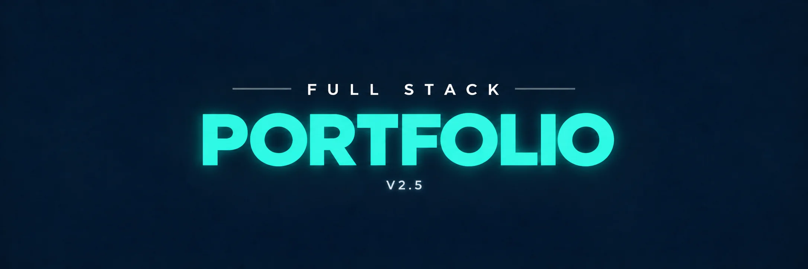

  <!-- cover logo -->
  

    
  

  <!-- sub headline -->
  <h2>
     My current portfolio website.
  </h2>
  <!-- tech used in this project -->
  

    
  

  <!-- demo link -->
  <h5>
      <a href='https://devongifford.vercel.app/', target='_blank'>
          live demo ↗
      <a/>
  </h5>

 

### About This Project

---

This portfolio was inspired by the [v4 version](https://v4.brittanychiang.com/) of Brittany Chiang’s site. While her original was built with **Gatsby**, I approached the rebuild using a more modern stack - **React v19**, **Next.js v16**, **TypeScript v6** & **Tailwind v4**.

_The content has also been separated from components and validated with **Zod** at build time. **Motion** handles animation, while **Vitest** covers a few focused sanity suites, with performance and accessibility tuned to 100 Lighthouse scores across the board._

 

### Acknowledgements

---

Built from scratch, with design inspiration from [Brittany Chiang](https://brittanychiang.com). Full credit for the original design concept goes to her. The [MIT License](LICENSE) covers this code, not the original design concept.

 

> [!TIP]
> **Want to steal this? Go for it.**  
> The [quickstart guide](QUICKSTART.md) will get you forking, customizing and deploying in about 5 minutes.    
> _If you found it useful, a ⭐ is always appreciated._  
